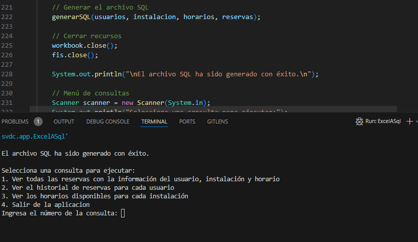

# Examen Acceso a Datos

Nombre | Apellidos | Fecha | Modulo | Modulo
---------|----------|---------|---------|---------
 Javier | Segovia Martinez | 13-11-2024 | Acceso a datos | Tema 2

## Proyecto

Para realizar este examen, deberemos primero pasar un excel a objeto, yo lo he leido y lo he pasado a lista, despues de pasarlo a lista, con ese objeto he pasado a sql, y he podido crear el .sql en una ruta especifica ./stack/scripts/initdb.sql

Con mi .env
```bash
MYSQL_ROOT_PASSWORD=9127836901 
MYSQL_USERNAME=root 
MYSQL_PORT=33310 
MYSQL_HOST=localhost 
MYSQL_DATABASE=reservas
ADMINER_PORT=8888
SERVICE_PORT=8000
```

Con mi docker-compose.yml
```bash
version: '3.1'

services:

  adminer:
    image: adminer
    restart: "no"
    ports:
      - ${ADMINER_PORT}:8080

  db-reservas:
    image: mysql:latest
    restart: "no"
    environment:
      MYSQL_ROOT_PASSWORD: ${MYSQL_ROOT_PASSWORD}
    ports:
      - ${MYSQL_PORT}:3306
    volumes:
      - ./scripts:/docker-entrypoint-initdb.d
```

Con esto crearemos la base de datos dentro de un contenedor docker, y lo levantaremos con docker-compose up -d, despues de esto deberemos hacer consultas, las cuales tendremos que crear una conexion con la base de datos mediante jdbc

```java
try (Connection conn = DriverManager.getConnection("jdbc:mysql://localhost:33310/reservas", "root", "9127836901");
             Statement stmt = conn.createStatement()) {
            ResultSet rs = stmt.executeQuery(consultaSQL);

            // Mostrar los resultados de la consulta
            ResultSetMetaData rsmd = rs.getMetaData();
            int columnCount = rsmd.getColumnCount();
            while (rs.next()) {
                for (int i = 1; i <= columnCount; i++) {
                    System.out.print(rs.getString(i) + "\t");
                }
                System.out.println();
            }
        } catch (SQLException e) {
            e.printStackTrace();
        }
```

En esta conexion jdbc, deberemos conectar mediante nuestro puerto de la BBDD, con el nombre de la base de datos, y conectando nuestro usuario, y nuestra contraseña, asi crearemos una conexion.

Y nos saldre esto, ya conectado donde podremos hacer consultas y nos saldran en consola

